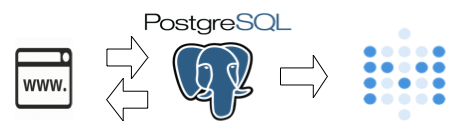
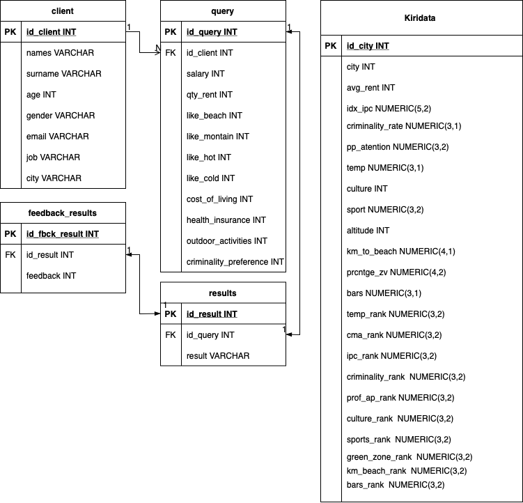

## Equipo KIRIBATI 

### Master en Data Analytics para la Empresa

#### Asignatura Programación Estadística con PYTHON

* [Lluis LLoret](https://github.com/luisllll)
* [Marco Colapietro](https://github.com/Marcolapietro)
* [Gonzalo  Alberola](https://github.com/GonzaloAP97)
* [Marta Álvarez](https://github.com/maalal)
* [Borja Ponz](https://github.com/fbponz)

#### 1) kiribati-dp1
Edem Kiribati-dp1

Una start up, capaz de elegir la ciudad ideal para el cliente en función de criterios objetivos y personales. 

Un match entre tú y la ciudad que mejor encaja contigo. 
 

##### 1.1) Video 
Enlace video demostrativo del MVP [Youtube](https://youtu.be/I0x2DN5eqkA) 
 

#### 2) MVP
Para dar solución al MVP del data project uno, se ha planteado implementar un formulario en una pagina web y ser capaces de proponer una ciudad al usuario. 
 

##### 2.1) Arquitectura 
La pagina web escribe los datos sobre una base datos (postgreSQL), se espera que se modifique poco a lo largo del proyecto.  
Después se ha implementado un panel de bussines intelligence utilizando la herramienta metabase, con el objetivo de poder ofrecer datos interesantes al gestor del negocio.
Nuestra solución contiene los siguientes elementos
 

 

##### 2.2) Ejecución data project
Para ejecutar el sistema del MVP es necesario descargar el repositorio y mediante el uso de la terminal consola, Lanzar el siguiente comando, debemos esperar unos minutos hasta que el sistema acabe de inicializar.

    $ docker-compose up -d

Una vez se ha terminado de trabajar se recomienda parar el contenedor haciendo un 

    $ docker-compose down

En caso de que tengas una versión previa se recomienda hacer despues de cada pull el siguiente comando

    $ docker-compose build

 

La información necesaria para acceder a cada uno de los elementos que componen este MVP están detallados a continuación.
 

##### 2.3) Pagina web
Se puede acceder a la pagina web desde el navegador mediante la siguiente dirección http://localhost:80
 
 

##### 2.4) Esquema base de datos
Para la implementación de la base de datos se ha elegido postgreSQL, el motivo principal de esta elección es que debido a que nuestros datos de entrada, provienen de un formulario definido por nosotros.

Para la solución implentada se ha utilizado el siguiente esquema de base de datos.
 

 

#### 3) Datos de accesso:
 
##### 3.1) Base de datos 
la base de datos postgreSQL está mapeada en el puerto 5432. Durante la inicialización de base datos por un lado se crean las tablas necesarias para el correcto funcionamiento del datap project 1 así como también se insertan los datos del dataset. 
 

| Base de datos |  kiriweb|
| :------------- | -----------: |
| Usuario      | kiriuser     |
|  Contraseña | kiripass    |

 
 

##### 3.2) PGADMIN
Para acceder al gestor de la base de datos PGADMIN. Se debe realizar desde el navegador en la siguiente dirección http://localhost:5050 haciendo uso de las siguientes credenciales:
 

| E-mail      | kiribati@kiriweb.org    |
| :------------- | -----------: |
| Password | Kiripass |

 
 

#####  3.3) METABASE 
Para acceder al panel de business Intelligence. Se debe realizar desde el navegador en la siguiente dirección http://localhost:3000 haciendo uso de las siguientes credenciales:
 

| E-mail      | kiribati@kiriweb.com |
| :------------- | -----------: |
| Password | kiripass1 |

 

####  4) Lineas de mejora
 

* Realizar la ingestión de los datos del dataset mediante nifi.
* Incluir más ciudades en el dataset.
* Mejorar el algoritmo de decisión teniendo en cuenta mas variables

  

## Kiribati Team
